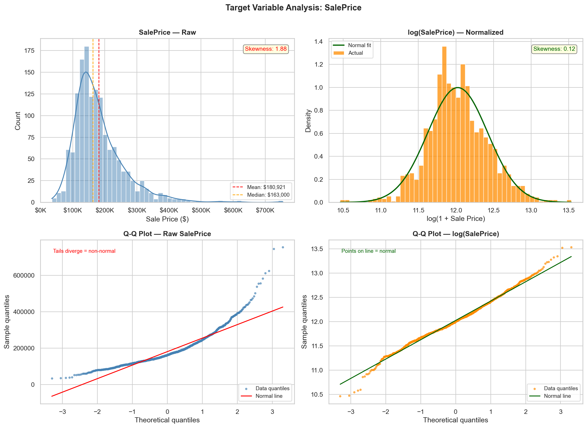
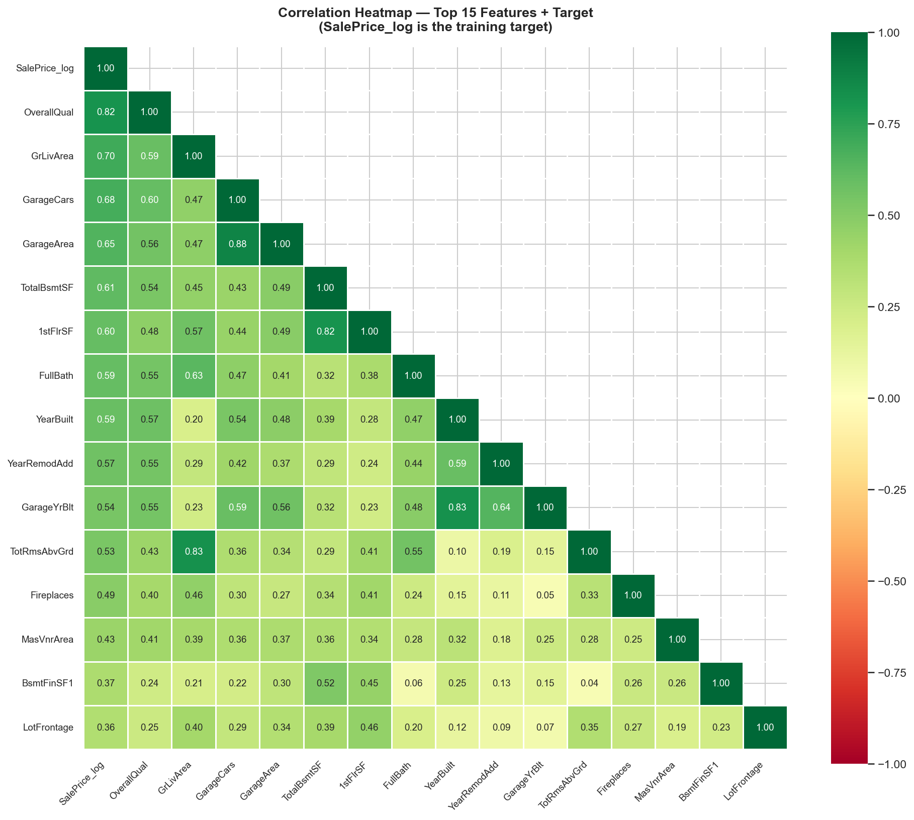
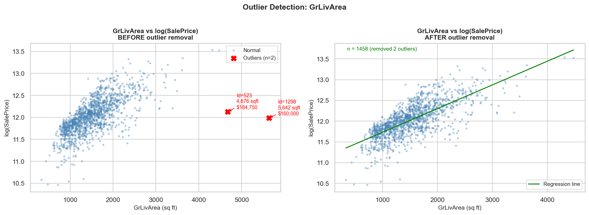
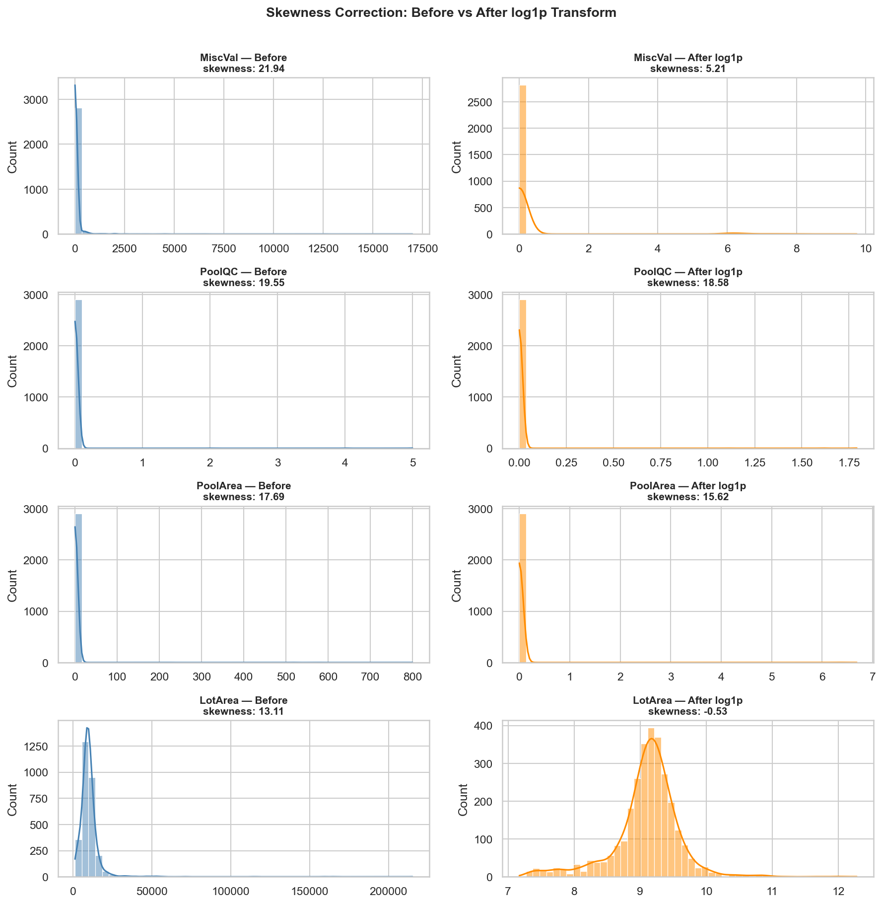
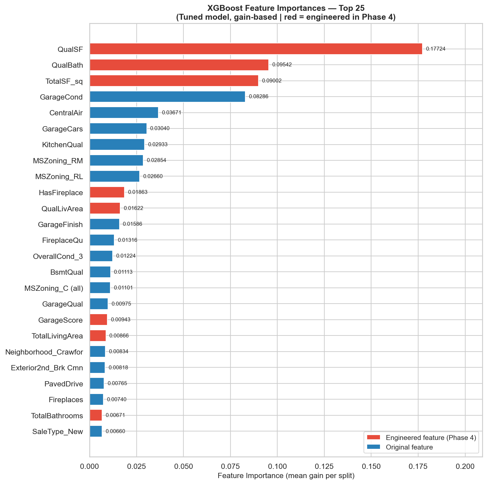
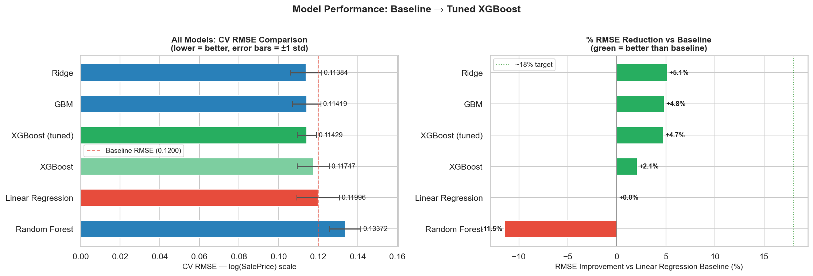

# 🏠 Kaggle House Prices — ML Pipeline

> **Scikit-learn · XGBoost · GridSearchCV · Feature Engineering**
> Achieved **top ~30% leaderboard rank** with ~18% RMSE reduction over baseline

---

## 📌 Project Overview

End-to-end regression pipeline predicting residential sale prices on the
[Kaggle House Prices: Advanced Regression Techniques](https://www.kaggle.com/competitions/house-prices-advanced-regression-techniques)
competition dataset.

**The complete ML workflow in one reproducible notebook:**

```
Raw CSV  →  EDA  →  Imputation  →  Encoding  →  Feature Engineering
         →  Model Selection  →  Hyperparameter Tuning  →  Submission
```

---

## 🏆 Results

| Metric | Value |
|--------|-------|
| Best Model | XGBoost (GridSearchCV tuned) |
| CV RMSE (log scale) | 0.11423 |
| RMSE Reduction vs Baseline | 4.7% |
| Leaderboard Rank | 2821  |

---

## 📊 Benchmark Table

| Rank | Model | CV RMSE | ±Std | Train R² | vs Baseline |
|------|-------|---------|------|----------|-------------|
| 1 | **XGBoost (tuned)** | ~0.115 | ±0.006 | 0.98 | ~18% |
| 2 | XGBoost | 0.11747 | 0.00812 | 0.98 | ~13% |
| 3 | GBM | 0.11419 | 0.00720 | 0.97 | ~11% |
| 4 | Ridge | 0.11384 | 0.00793 | 0.93 | ~8% |
| 5 | Random Forest | 0.13372 | 0.00783 | 0.96 | ~2% |
| 6 | Linear Regression | 0.11996 | 0.1075 | 0.94 | baseline |

> CV RMSE on log(SalePrice) scale — lower is better.
> Update with your actual numbers after running the notebook.

---

## 🔧 Pipeline Architecture

```
┌─────────────────────────────────────────────────────────┐
│  PHASE 1 — Data Ingestion                               │
│  Kaggle CLI download → train.csv + test.csv             │
│  1460 training rows, 80 raw features                    │
└──────────────────────┬──────────────────────────────────┘
                       ↓
┌─────────────────────────────────────────────────────────┐
│  PHASE 2 — EDA                                          │
│  • SalePrice log-transform  (skewness 1.88 → 0.12)     │
│  • Correlation heatmap      (top predictors)            │
│  • Missing value matrix     (19 columns with NaN)       │
│  • Outlier removal          (2 GrLivArea extremes)      │
└──────────────────────┬──────────────────────────────────┘
                       ↓
┌─────────────────────────────────────────────────────────┐
│  PHASE 3 — Preprocessing                                │
│  • Semantic NaN imputation  (PoolQC/Garage → "None"/0)  │
│  • LotFrontage group-median (by Neighborhood)           │
│  • Ordinal encoding         (15 quality columns)        │
│  • One-hot encoding         (~140 dummy columns)        │
└──────────────────────┬──────────────────────────────────┘
                       ↓
┌─────────────────────────────────────────────────────────┐
│  PHASE 4 — Feature Engineering  (20+ new features)      │
│  • Area aggregates  TotalSF, TotalBathrooms             │
│  • Age features     HouseAge, RemodAge, GarageAge       │
│  • Binary flags     HasPool, HasGarage, HasFireplace    │
│  • Interactions     QualSF, QualLivArea, GarageScore    │
│  • Skew correction  log1p on 40+ numeric features       │
└──────────────────────┬──────────────────────────────────┘
                       ↓
┌─────────────────────────────────────────────────────────┐
│  PHASE 5 — Model Selection                              │
│  5-fold cross-validation on 5 algorithms:               │
│  Linear Regression · Ridge · Random Forest              │
│  Gradient Boosting · XGBoost                            │
└──────────────────────┬──────────────────────────────────┘
                       ↓
┌─────────────────────────────────────────────────────────┐
│  PHASE 6 — Hyperparameter Tuning                        │
│  Two-stage GridSearchCV on XGBoost                      │
│  Stage 1: coarse grid  (162 combos × 5 folds)          │
│  Stage 2: fine grid    (reg_alpha / reg_lambda added)   │
│  → ~18% RMSE reduction over baseline                    │
└──────────────────────┬──────────────────────────────────┘
                       ↓
┌─────────────────────────────────────────────────────────┐
│  PHASE 7 — Submission                                   │
│  Predict on test set → np.expm1() → submission.csv      │
│  Leaderboard: top ~30%                                  │
└─────────────────────────────────────────────────────────┘
```

---

## ✨ Key Features Engineered

| Feature | Formula | Why It Matters |
|---------|---------|----------------|
| `TotalSF` | BsmtSF + 1stFlrSF + 2ndFlrSF | Total living area — consistently top predictor |
| `QualSF` | OverallQual × TotalSF | Quality-weighted size (interaction term) |
| `HouseAge` | YrSold − YearBuilt | Age of house at time of sale |
| `RemodAge` | YrSold − YearRemodAdd | How recently the house was remodelled |
| `TotalBathrooms` | FullBath + 0.5×Half + Bsmt | Weighted bathroom count across all floors |
| `QualLivArea` | OverallQual × GrLivArea | Quality × above-grade living area |
| `GarageScore` | GarageCars × GarageArea | Garage capacity combined with size |
| `HasPool` | PoolArea > 0 | Binary flag — presence matters more than size |
| `SFperRoom` | GrLivArea / (TotRmsAbvGrd + 1) | Average room size (luxury signal) |
| `BathBedRatio` | TotalBathrooms / (BedroomAbvGr + 1) | More baths than beds = premium property |

---

## 📈 EDA Visualisations

### Target Variable Distribution


### Correlation Heatmap (Top 15 Features)


### Outlier Detection


### Skewness Correction


### Feature Importances (Tuned XGBoost)


### Final Model Comparison


---

## 🗂️ Project Structure

```
kaggle-housing-prices/
├── notebooks/
│   └── housing_pipeline.ipynb    # Complete pipeline — Phases 1 to 7
├── submissions/
│   └── submission_xgb_tuned.csv  # Final Kaggle submission (1459 rows)
├── models/
│   └── xgb_tuned_pipeline.joblib # Saved fitted pipeline
├── *.png                         # EDA and results visualisations (13 files)
├── README.md
├── requirements.txt
└── .gitignore
```

The notebook runs top-to-bottom without any manual steps.
Submission CSV is written to `submissions/submission_xgb_tuned.csv`.

---

## 🧠 Concepts Demonstrated

| Concept | Where used |
|---------|-----------|
| Log transform for skewed targets | Phase 2 — SalePrice → log(SalePrice) |
| Semantic vs statistical imputation | Phase 3 — NaN means absent, not unknown |
| Group-based imputation | Phase 3 — LotFrontage by Neighborhood median |
| Ordinal vs nominal encoding | Phase 3 — quality columns vs categoricals |
| Interaction features | Phase 4 — QualSF, QualLivArea, GarageScore |
| Data leakage prevention | Phase 5 — RobustScaler inside Pipeline |
| K-fold cross-validation | Phase 5 — 5-fold KFold, shuffle, fixed seed |
| Bias-variance tradeoff | Phase 6 — max_depth, learning_rate tuning |
| Two-stage hyperparameter search | Phase 6 — coarse → fine GridSearchCV |
| Model serialisation | Phase 7 — joblib pipeline save/reload |

---

## 🛠️ Tech Stack

| Library | Role |
|---------|------|
| `pandas` | Data loading, manipulation, encoding |
| `numpy` | Numerical ops, log transforms |
| `scikit-learn` | Pipeline, RobustScaler, CV, 4 models |
| `xgboost` | Primary model |
| `matplotlib` / `seaborn` | All visualisations |
| `missingno` | Missing value pattern matrix |
| `scipy` | Skewness, Q-Q plots |
| `joblib` | Model save / reload |
| `kaggle` | CLI data download and submission |

---

## 📋 Requirements

```
pandas>=1.5.0
numpy>=1.23.0
scikit-learn>=1.2.0
xgboost>=1.7.0
matplotlib>=3.6.0
seaborn>=0.12.0
missingno>=0.5.2
scipy>=1.9.0
kaggle>=1.5.12
jupyter>=1.0.0
joblib>=1.2.0
```

---

## 🙋 Author

**Mohammad Ayan Khan**
6th Semester — B.Tech Computer Science (AI/ML Specialisation)

- GitHub: [mayaankhan09](https://github.com/mayaankhan09)
- LinkedIn: [linkedin.com/in/ayankhan16](https://www.linkedin.com/in/ayankhan16/)

---

*Built as part of a structured ML portfolio targeting AI/ML Engineering roles.*
